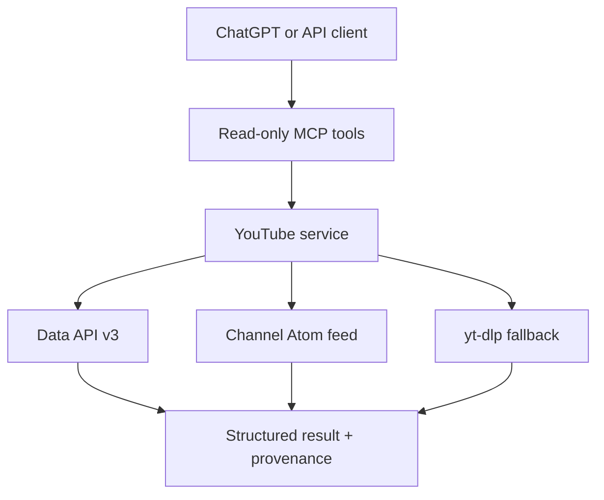

# Architecture decision

## Decision

Build a small read-only remote MCP server. Use a source ladder per capability instead of forcing every operation through one YouTube mechanism:



Priority rules:

1. Official YouTube Data API v3 for metadata, channels, and search when `YOUTUBE_API_KEY` exists.
2. Public Atom feed for recent channel uploads.
3. `yt-dlp` for public transcripts because no official arbitrary-video transcript endpoint exists.
4. `yt-dlp` as a visibly unofficial no-key fallback for metadata, channel resolution, and search.

## Why not a skill alone?

A skill can tell ChatGPT to inspect metadata and transcript, but it cannot create live YouTube access. The MCP server is the capability. A later plugin may add a small skill that teaches the preferred workflow: call `get_video`, then `get_video_transcript` when analysis needs actual spoken content, and distinguish description claims from transcript evidence.

## Security and privacy

- All tools are marked `readOnlyHint=true`, `destructiveHint=false`, and idempotent.
- Only YouTube video/channel references are accepted; arbitrary upstream URLs are not fetched from tool input.
- API keys remain environment variables on the server.
- Transcript output is bounded; default maximum is 60,000 characters.
- `yt-dlp` runs as an argument vector, never through a shell.
- Docker runs as an unprivileged user with a read-only filesystem and no-new-privileges.
- The PoC has no user account mutation tools and no Google OAuth token storage.

## Reliability behavior

Every success includes:

```json
{
  "provenance": {
    "source": "youtube_data_api_v3 | youtube_atom_feed | yt_dlp | yt_dlp_youtube_caption_endpoint",
    "official": true,
    "retrieved_at": "RFC3339 timestamp",
    "note": "optional limitation"
  }
}
```

Expected failures are returned as structured `{ok:false,error:{code,message,retryable}}` results. A five-minute in-memory cache avoids repeating expensive `yt-dlp` video discovery across `get_video`, caption listing, and transcript calls.

## Generalization beyond YouTube

Do not build a universal scraper. Build a registry of narrow providers with typed capabilities:

```python
class Provider:
    name: str
    capabilities: set[str]

    def normalize_reference(self, value: str) -> Reference: ...
    def get_item(self, reference: Reference) -> Result: ...
    def search(self, query: SearchQuery) -> Result: ...
```

Platform-independent layers:

| Layer | Reusable responsibility |
| --- | --- |
| MCP facade | Tool schemas, read-only annotations, error envelope, output limits |
| Provider registry | Route a normalized reference/capability to one provider |
| Credential vault | Server-side API keys and OAuth tokens; never tool output |
| Provenance | Source, official/unofficial status, retrieval time, caveats |
| Policy | Allowed methods, hosts, scopes, per-provider rate limits |
| Cache | Short TTL, source-aware cache keys, no cross-user private-data leakage |
| Observability | Latency, upstream failures, quota/rate-limit metrics without secrets |

Good next providers are RSS/Atom and home-lab APIs because they have clean read semantics. GitHub has official MCP/API options. Reddit and Mastodon have APIs but require platform-specific auth and policy. Instagram/Meta should only be added through officially permitted APIs and scopes; no generic scraping adapter.

## Phase 2: personal subscriptions

Add only after the anonymous public-data path is stable:

1. Implement Google OAuth authorization-code flow server-side.
2. Request the minimum read scope needed for subscriptions.
3. Store refresh tokens encrypted per MCP user identity.
4. Add `get_my_subscriptions` and `get_subscription_uploads`; keep them read-only.
5. Never accept access/refresh tokens as model tool parameters.
6. Add multi-user cache isolation and revoke/disconnect handling.

